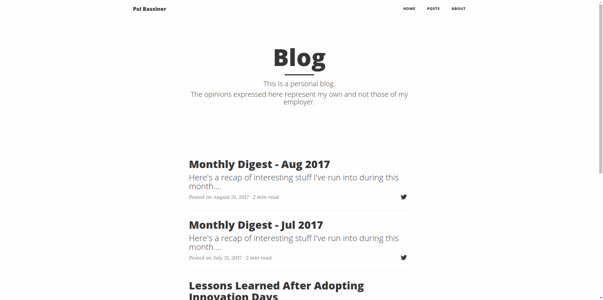

In any web project with some kind of UI involved it's usually convenient to have, at least, a basic suite of automated User Acceptance Tests. In contrast to unit and even integration tests, these are likely to be the most fragile and therefore, the most expensive to maintain.

This is because they are typically end-to-end tests which involve all the moving pieces from a system (a UI, one or more APIs, storage, etc). A slight change on any part of the system can break those tests.

When something goes wrong during a test execution you can easily generate a screenshot, dump the current DOM and write the browser's JavaScript logs to a file for further analysis.

Having all this in place, what about periodically taking a screenshot and generating a GIF with all of them?

It could be useful at some point. In the meantime though, we can *do it for the lulz*.

# Let's go for it
First of all we need a GIF generator. I found [this one](http://elliot.kroo.net/software/java/GifSequenceWriter/GifSequenceWriter.java) by [Elliot Kroo](https://github.com/kroo), although I had to tweak it just a bit (the modified version is available in [this gist](https://gist.github.com/pbassiner/d9c43e8279865dbc066a620e88560d8d#file-gifsequencewriter-java)).

Now we need to continuously perform some actions while the test is executing:
1. take a screenshot (using [Selenium Webdriver](http://www.seleniumhq.org/docs/03_webdriver.jsp))
2. read the screenshot file
3. write it into the GIF generator
4. delete the screenshot file

[Akka Streams](http://doc.akka.io/docs/akka/current/java/stream/) seems a got fit to implement it:

Since this `Stream` is infinite, we need to return both the `Cancellable` (something that can be cancelled) and the result, wrapped in a `Future`. Then we just need to wait for the test to end to stop the stream and close the GIF generator.

This is the full code of the test recorder:

The recorder receives the test as a by-name parameter, in particular, a *thunk* (a function of zero arguments `() => T`). Then it starts the test recorder stream, runs the test and finally signals the cancellation of the stream, awaits for its result and closes all the resources.

# Usage
To add this capability to a test we simply wrap the test with the recorder's `record` method and provide an instance of a `WebDriver`, the path where to store the screenshots and the function to be used to output the resulting GIF's path:

# Result
And this is the result (<i style="cursor: pointer" class="fa fa-repeat" aria-hidden="true" onClick="$('img[alt=test_recorder]').attr('src','../assets/2017-09-22.Recording_UI_Tests_Using_Scalatest,_Selenium_and_Akka.recording.gif');"> replay</i>):

# The reader's reaction

